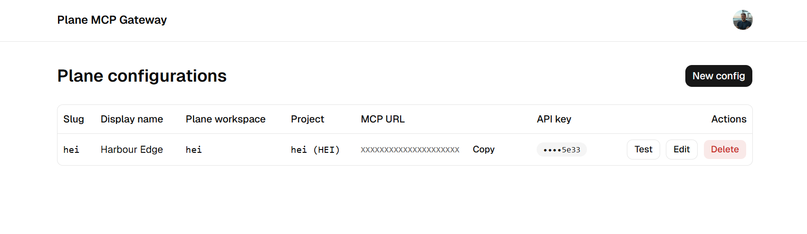

# plane-mcp-gw

A multi-tenant [Plane](https://plane.so/) MCP gateway that runs on Cloudflare Workers.



Sign in with Clerk, register one or more Plane workspace+API-key configurations in a web UI, and connect any MCP client to `https://<host>/mcp/<slug>` — each slug picks its own Plane config. Optionally pin a single project per config to hide every `project_id` parameter from the tool schemas.

## What this is

- **OAuth 2.1 MCP server** ([`@cloudflare/workers-oauth-provider`](https://github.com/cloudflare/workers-oauth-provider)) backed by Clerk as the upstream identity provider.
- **A Plane tool suite** ported from the official Python [`plane-mcp-server`](https://github.com/makeplane/plane-mcp-server) — ~109 tools across projects, work items, cycles, modules, labels, states, pages, milestones, initiatives, intake, work logs, and more. Tool and parameter names match the Python server verbatim.
- **Per-user, per-slug configurations** stored in Cloudflare KV. Each `/mcp/<slug>` resolves to its own workspace+API-key+optional pinned project.
- **A TanStack Start + shadcn/ui web UI** for managing those configurations, signed in with Clerk.

## Architecture

```
                            ┌─────────────────────────┐
  request URL               │  src/server.ts (Worker) │
  ──────────────────────────┴──────────┬──────────────┘
                                       │
  /mcp/<slug>/* or /sse/<slug>/*  ──►  │  rewrite path, set X-Plane-Config-Slug
                                       │  ─► OAuthProvider.fetch
                                       │      ─► MyMCP DO (src/mcp/mcp-app.ts)
                                       │          ─► loadConfig(KV)
                                       │          ─► registerPlaneTools(server, ctx)
                                       │
  /authorize, /callback,         ──►   │  OAuthProvider (with HTTPS metadata fix +
  /register, /token,                   │  RFC 9728 WWW-Authenticate enrichment)
  /.well-known/*                       │
                                       │
  /api/*                         ──►   │  Hono app (src/api/index.ts)
                                       │   Clerk authenticateRequest middleware
                                       │   /configs CRUD + /test + /projects
                                       │
  everything else                ──►   │  TanStack Start UI (app/)
```

### Key pieces

- `src/server.ts` — top-level dispatcher.
- `src/mcp/mcp-app.ts` — `MyMCP` Durable Object. Seals one slug per session, loads config from KV, computes the `instructions` text (workspace + project table + URL patterns), registers the Plane tool suite, and auto-refreshes the tool list when KV state changes (`tools/list_changed`). Returns HTTP 410 when the underlying config is deleted.
- `src/plane/client.ts` — `planeFetch` with retry/backoff. Paths exclude `/api/v1/` and the trailing slash; the client adds both. Work items live at `/work-items/` (hyphenated).
- `src/plane/storage.ts` — `PlaneConfigRecord` and KV helpers (`plane:cfg:<userId>:<slug>`); slug validation against a reserved-word list (`well-known`, `mcp`, `sse`, `api`, `app`, …); API key redaction.
- `src/api/index.ts` — JSON API for the UI.
- `app/` — TanStack Start UI with shadcn/ui + Tailwind v4.

## Prerequisites

- [Bun](https://bun.sh/) (project uses `bun.lock`)
- A free [Clerk](https://dashboard.clerk.com/) account
- A [Plane](https://plane.so/) workspace + API key
- A Cloudflare account (for deploy)

## Local development

```bash
bun install
cp .env.example .env          # then fill in Clerk values
bun run dev                   # http://localhost:8788
```

`bun run type-check` and `bun run lint` validate the codebase.

Visit `http://localhost:8788`:
- Unauthenticated → 307 → `/sign-in` (Clerk widget).
- Signed in → `/app/configs` (create your first Plane config).
- Once a config exists, copy `http://localhost:8788/mcp/<slug>` and add it to your MCP client (Claude Code, MCP Inspector, etc.).

### Testing with the MCP Inspector

```bash
bunx @modelcontextprotocol/inspector@latest
# Connect to http://localhost:8788/mcp/<slug>  (Streamable HTTP)
# Or:        http://localhost:8788/sse/<slug>  (deprecated SSE)
```

## Clerk setup

In the [Clerk dashboard](https://dashboard.clerk.com/):

1. Create an OAuth application. Set its **redirect URL** to:
   - local dev: `http://localhost:8788/callback`
   - production: `https://<your-host>/callback`
2. Use these exact OAuth scopes:
   ```
   email offline_access openid profile public_metadata
   ```
3. Copy these values into your `.env` (and as Wrangler secrets in production):
   - `CLERK_CLIENT_ID`, `CLERK_CLIENT_SECRET` — from the OAuth application
   - `CLERK_SECRET_KEY`, `CLERK_PUBLISHABLE_KEY` — from **API Keys**
   - `CLERK_FRONTEND_API` — your Clerk Frontend API URL (e.g. `https://your-subdomain.clerk.accounts.dev`)

## Production deploy

```bash
# 1. Create the KV namespace and paste its id into wrangler.jsonc
wrangler kv namespace create OAUTH_KV

# 2. Set secrets
wrangler secret put CLERK_CLIENT_ID
wrangler secret put CLERK_CLIENT_SECRET
wrangler secret put CLERK_SECRET_KEY
wrangler secret put CLERK_PUBLISHABLE_KEY
wrangler secret put CLERK_FRONTEND_API
wrangler secret put COOKIE_ENCRYPTION_KEY   # openssl rand -hex 32

# 3. Deploy
bun run deploy
```

In Clerk, add `https://<your-host>/callback` as an allowed redirect URL for the OAuth application.

## Connecting an MCP client

```
https://<your-host>/mcp/<your-slug>
```

The client will go through Clerk OAuth, then receive an MCP token bound to your user. Each slug is sealed to a single Durable Object session, so per-tenant state stays isolated.

When a config is **pinned** to a project (set `projectId` in the UI), the `project_id` parameter disappears from every project-scoped tool's schema — tools operate directly against the pinned project, and `list_projects` / `create_project` / `delete_project` are not registered at all.

## License

Apache 2.0 — see [LICENSE](LICENSE).
